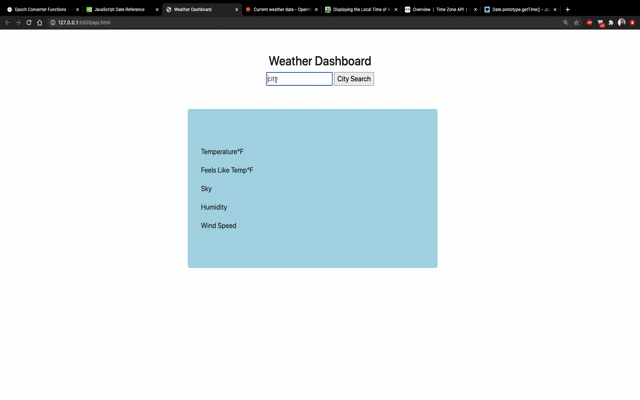

# API Skill Challenge 

## Skill Challenge Description 
* Create a weather app using an API from [Open Weather Map](https://openweathermap.org/guide#how)

## User Story 
    As a student I want to create a weather app that accepts user input for the city.
    Displays weather for the city user has typed in.
    
## Acceptance Criteria 
**_Given_** that the user is showed the search box to input city.

**_When_** the user enters a city name.

**_Then_** As user selects city weather information is displayed.

---
## Remember TechBridge TECH Goals

**_T_** : Time management skills will provide a positive guide for you.

**_E_** : Effort is an important part of the success of the course.
    
**_C_** : Communication regularly with the instructor and other students is imperative.
    
**_H_** :  Homework, assignments and quizzes should be submitted by deadlines.

---
### Bonus 
* Add additional sunrise and sunset timings to app.
* Add a `gif` to showcase your work.
---
### App

## ❤ **_Happy Coding_** ❤
